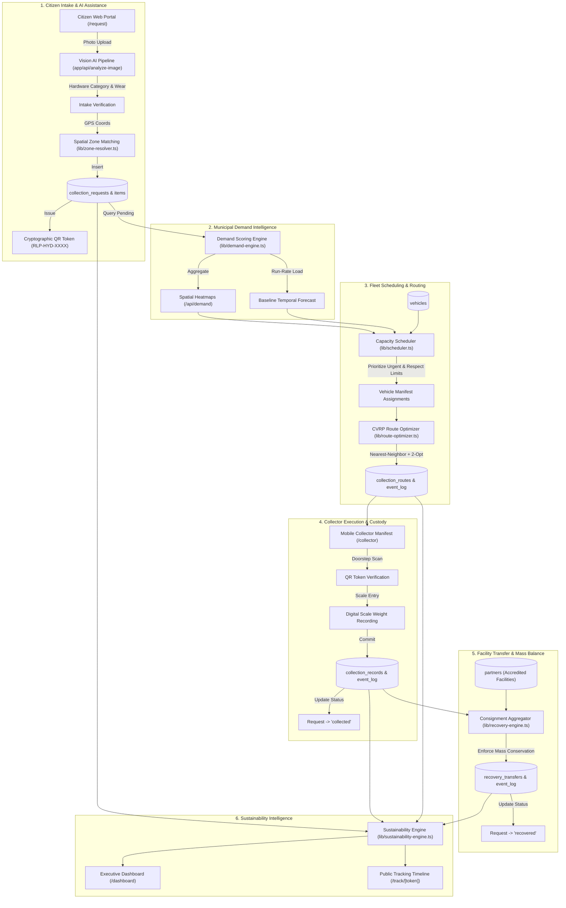

# PS-013 Technical Architecture Specification
**Project:** RE:LOOP — Intelligent E-Waste Collection & Recovery  
**Problem Statement:** TH2-PS-SD-013 (Community E-Waste Collection Optimizer)  
**System Version:** 2.0 (Post-Prompt 6 Final Integration)  
**Date:** October 8, 2026  

---

## 1. End-to-End System Architecture

---

## 2. Technical Classification & Honesty Matrix

To uphold our strict engineering ethics guidelines, every component is explicitly classified by its computational methodology:

| Pipeline Stage | Module / Component | Computational Nature | Method / Implementation |
|---|---|---|---|
| **Intake Classification** | `app/api/analyze-image/route.ts` | **AI (Generative Vision)** | Google Gemini 2.5 Flash multimodal API extracts device category, estimated brand, and physical wear from uploaded photos. Requires user verification. |
| **Zone Resolution** | `lib/zone-resolver.ts` | **Deterministic** | Haversine great-circle distance algorithm calculates radial distance to metropolitan zone centroids and selects nearest boundary. |
| **Demand Scoring** | `lib/demand-engine.ts` | **Deterministic** | Weighted polynomial formula evaluating volume (10 pts), mass (1.5 pts/kg), priority bonuses (15–25 pts), and 24h recency (10 pts). |
| **Demand Forecast** | `lib/demand-engine.ts` | **Deterministic** | Moving average / run-rate projection based on historical intake patterns. **No fake machine learning or ungrounded regression claims.** |
| **Fleet Assignment** | `lib/scheduler.ts` | **Deterministic** | Greedy priority queue sorting requests by urgency, fitting into vehicle payload bounds, and explicitly deferring overflow. |
| **Route Optimization** | `lib/route-optimizer.ts` | **Heuristic (Non-AI)** | Capacitated Vehicle Routing Problem (CVRP) solved via Nearest-Neighbor construction followed by 2-Opt segment inversion and relocate search. **Described as heuristic optimization, not global mathematical optimum.** |
| **Scale Verification** | `app/api/collector/collect/route.ts` | **Measured** | Actual physical mass entered by certified collectors using calibrated digital scales at citizen doorstep. |
| **Batch Custody Transfer** | `lib/recovery-engine.ts` | **Deterministic** | Summation of actual scale weights from verified collection records. |
| **Mass Balance Allocation** | `lib/recovery-engine.ts` | **Deterministic** | Conservation of mass check: Refurbished % + Recycled % + Residual % $\le$ 100%. Exact kg calculated per stream. |
| **Operational Eco-Metrics** | `lib/sustainability-engine.ts` | **Measured / Derived** | Aggregated from live database rows: total kg collected, diversion rate %, kg/km efficiency, fleet utilization %. |
| **Environmental Impacts** | `lib/sustainability-engine.ts` | **Estimated** | Explicitly badged as **`ESTIMATE`**: Lifecycle Assessment (LCA) models computing avoided carbon emissions (45 kg $\text{CO}_2\text{e}$/kg refurbished IT, 12.5 kg $\text{CO}_2\text{e}$/kg recycled metal) and landfill volume (bulk density 250 kg/$\text{m}^3$). |
| **Historical Baselines** | Seed Migrations / Scenarios | **Simulated** | Explicitly tagged with `is_simulated: true` and labelled as **`SIMULATED DEMONSTRATION DATA`** on all UI views. |

---

## 3. Database Schema Mapping & Entity Relationships

### Core Operational Tables
1. **`collection_zones`**: 10 administrative metropolitan clusters in Hyderabad with center lat/lng coordinates and operational radii.
2. **`collection_requests`**: Citizen pickup requests with addresses, contact details, scheduled time slots, and unique QR tokens (`RLP-HYD-XXXX`).
3. **`items`**: Individual electronic appliances linked via foreign key (`request_id`) to requests. Captures category, brand, condition, and weight.
4. **`vehicles`**: Municipal collection fleet with fuel types, depot coordinates, and payload capacities (350 kg to 1,200 kg).
5. **`collection_routes`**: Sequenced vehicle itineraries generated by CVRP heuristic, storing ordered stop JSON manifests and distance metrics.
6. **`collection_records`**: Immutable doorstep collection logs capturing actual verified scale weights and collection timestamps.
7. **`recovery_transfers`**: Consignment transfers to accredited facilities tracking percentage allocations across refurbished, recycled, and residual streams.
8. **`partners`**: 40 accredited recycling facilities, refurbishment centers, and dismantling plants in Hyderabad and Bengaluru.
9. **`event_log`**: PostgreSQL append-only audit trail protected by database triggers that strictly prohibit `UPDATE` and `DELETE` operations.

---

## 4. Privacy & Authorization Architecture

- **Public Views (`/track/[token]`, `/api/demand`, Public Dashboard):**
  - All sensitive citizen Personally Identifiable Information (PII) is stripped.
  - Addresses are truncated to locality/zone names (e.g., "Madhapur, Hyderabad").
  - Latitude, longitude, phone numbers, and internal route IDs are shielded.
- **Operational Views (`/dispatch`, `/collector`, `/dashboard`):**
  - Collector operations require authorized role clearance.
  - Recovery transfers and mass balance allocations are restricted to dispatchers and facility managers.
  - Development role boundary (`x-user-role`) enables seamless evaluation across actor personas, with full post-hackathon Supabase Auth migration planned.

---

## 5. Summary Quality Verification
- **Automated Tests:** 85 / 85 tests passing across 12 test suites.
- **TypeScript Validity:** 0 compilation errors (`tsc --noEmit`).
- **ESLint Compliance:** 0 warnings, 0 errors.
- **Production Build:** 22 / 22 static and dynamic routes compiled cleanly.
- **Live Database Verification:** Complete 9-step synthetic lifecycle test passed on connected Supabase instance with zero test residue remaining.
